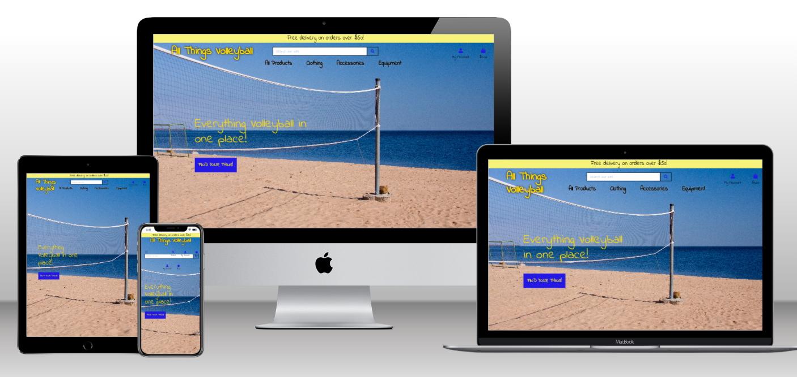
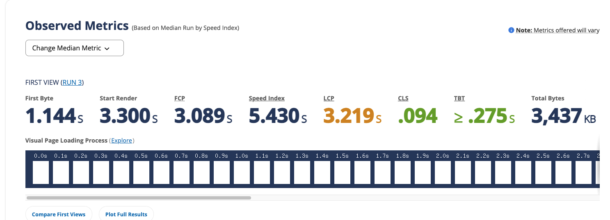

<h1 align="center">All Things Volleyball</h1>

<h2 align="center"></h2>

# About

An e-commerce website specifically relating to Volleyball clothing, accessories, and equipment, in other words ‘All Things Volleyball’. I, the developer, am a keen Volleyball player at Amateur level and play in a local club. Having an outdoor Tournament approaching I noticed that trying to find any volleyball related products seem to be on lots of different websites and I thought, why not have one place for everything I need? The website is designed to be responsive and accessible on a wide range of devices, making it easy for everyone to access and use whether they're on the go or sitting at a desktop.

I created the site to give an outdoor sun and beach feel in keeping with a beach volleyball theme. Sky & water blue colours with Sun yellow colours to achieve the theme which aslso coincides with the 'Mikasa' Volleyball Ball brand colouring.

[View the live project here.](https://all-things-volleyball.herokuapp.com/)

## **Contents**

- [**UX (User Experience)**](#ux-user-experience)
  - [**User Stories**](#user-stories)
  - [**Site Owner Goals**](#site-owner-goals)
- [**Design Choices**](#design-choices)
  - [**Fonts**](#fonts)
  - [**Colours**](#colours)
  - [**Imagery**](#imagery)
  - [**Wireframes**](#wireframes)
- [**Technologies**](#technologies)
  - [**Languages**](#languages)
  - [**Frameworks**](#frameworks)
  - [**Database**](#database)
  - [**Extensions and kits**](#extensions-and-kits)
  - [**Project Management**](#project-management)
  - [**Tools**](#tools)
- [**Features**](#features)
  - [**Features Implemented**](#features-implemented)
  - [**Future Features**](#future-features)
  - [**Responsive Design**](#responsive-design)
- [**Version Control**](#version-control)
- [**Testing**](#testing)
  - [**Functionality Testing**](#functionality-testing)
  - [**User Story Testing**](#user-story-testing)
  - [**Performance Testing**](#performance-testing)
  - [**Responsive**](#responsive)
- [**Deployment**](#deployment)
  - [**Requirements**](#requirements)
- [**Credits**](#credits)
  - [**Code**](#code)
  - [**Content**](#content)
  - [**Layout**](#layout)
  - [**Acknowledgements**](#acknowledgements)
  

## **UX (User Experience)**

### **User Stories**

story id | As a | I want to be able to | So that I can
---------|------|----------------------|--------------
1.      |Shopper|View a list of products| Select some to purchase
2.      |Shopper|View individual product details| Image, Short Description, Price, Rating and available sizes
4.      |Shopper|Easily view the total of my purchases at any time|Avoid spending too much
5.      |Site user|Easily register for an account|Have a personal account and view my profile
6.      |Site user|Easily login or out|
7.      |Site user|Easily recover my password if I forget it|Recover access to my account
8.      |Site user|Recieve an email confirmation of registration|Verify that my account registration was successful
9.      |Site user|Have a personalised view profile|View order history
10.     |Shopper|Sort the list of available products|By rate,price,category
11.     |Shopper|Sort a specific category of product|
12.     |Shopper|Sort multiple categories simultaneously|
13.     |Shopper|Search for a product by name or description|
14.     |Shopper|Easily see what I've searched for and the number of results|
15.     |Shopper| Easily select the size and quantity of a product when purchasing it|Ensure I don't accidently select the wrong product, size or quantity                 
16.     |Shopper|View items in my bag to be purchased |
17.     |Shopper|Adjust the quantity of individual items in my bag|
18.     |Shopper|Easily enter my payment information|Checkout quickly, with no hassle
19.     |Shopper|Personal and payment info is safe and secure|Confidently provide the info to make a purchase
20.     |Shopper|View an order confirmation after checkout| Verify I haven't made mistakes
21.     |Shopper|Receive an email confirmation after checkout| 
22.     |Store Owner|Add a product|
23.     |Store Owner|Edit/update product|
24.     |Store Owner| Delete a product|Remove item that is no longer for sale.

### **Site Owner Goals** 
- As a site owner I want to achieve an overall easy to use shopping site for everything volleyball related.
- As a site owner I want to ensure the site is safe and secure for all users.
- As a site owner I want users to have a clear, 
- As a site owner I want to create a website with a great user experience so that family members will enjoy using the app again and again and keeping the family history alive.

[Back to contents](#contents)
## **Design Choices**

### **Fonts**

I wanted to create a relaxed feel and therefore utilised the Googe Fonts 'Indie Flower' font ['https://fonts.google.com/specimen/Indie+Flower']
### **Colours**

As the site purpose is to display a Volleyballe themed shopping site I chose the typical colour of the MIKASA Volleyball brand which is Blue, Yellow and White. Most Volleyball players are familiar with these colours. I decided to use the standard RGB colours rather than a colour palette this time.

### **Imagery**

Images feature a Beach Volleyball court in the sand for the home page background. 

The image was sourced from:

1. [pixabay.com](https://pixabay.com/photos/lake-grid-volleyball-beach-5374190/) 

### **Wireframes**

Wireframes were created using 'Balsamiq' hand drawn and can be found in pdf form in [wireframes](/workspace/All_Things_Volleyball/All_Things_Volleyball/Wireframes)

- [Home Page - Desktop](static/Wireframes/HomePageDesktop.png)
- [Home Page - Tablet & Mobile](static/Wireframes/HomePageTabletMobile.png)
- [Product Page - Desktop](static/Wireframes/ProductPageDesktop.png)
- [Product Page - Tablet & Mobile](static/Wireframes/ProductPageTabletMobile.png)


[Back to contents](#contents)

## **Technologies**

### **Languages**

- [HTML5](https://developer.mozilla.org/en-US/docs/Web/HTML)
  - Used as the main markup language for the website content.
- [CSS3](https://developer.mozilla.org/en-US/docs/Web/CSS)
  - Used to style the individual webpages.
- [Python](https://developer.mozilla.org/en-US/docs/Glossary/jQuery) 
- [JavaScript]( https://developer.mozilla.org/en-US/docs/Web/JavaScript)

### **Frameworks**

- [Bootstrap CDN](https://stackpath.bootstrapcdn.com/bootstrap/4.4.1/js/bootstrap.min.js)
  - Used to design a mobile-first responsive website layout along with custom components.
- [JQuery](https://code.jquery.com/jquery-3.4.1.min.js)
- [JSDeliver](https://cdn.jsdelivr.net/npm/popper.js@1.16.0/dist/umd/popper.min.js)
- [Bootstrap CDN](https://stackpath.bootstrapcdn.com/bootstrap/4.4.1/js/bootstrap.min.js)
- [Django](https://www.djangoproject.com/)
  - "A high-level Python web framework that encourages rapid development and clean, pragmatic design".

### **Database**

- [sqlite3](https://www.sqlite.org/index.html)

- [Heroku Postgres](https://www.heroku.com/postgres)

A relational database is best suited to this project given the number of relationships between the models. SQLite was used during development and Heroku Postgres in production. The diagram below may help visualise the database and relationships between each model.


### **Extensions and kits**

- [Boto3](https://boto3.amazonaws.com/v1/documentation/api/latest/index.html)

- [Pillow](https://pillow.readthedocs.io/en/stable/)

- [stripe](https://stripe.com/docs)

### **Project Management**

- [Amazon AWS](https://aws.amazon.com/?nc2=h_lg) (S3, IAM)

- [Github](https://github.com/)

- [Heroku](https://heroku.com)
### **Tools**

- [Git](https://git-scm.com/)
  - Git was used for version control (commit to Git and push to GitHub).
- [GitHub](https://github.com/)
  - Used to store, host and deploy the project files and source code after being pushed from Git. 
- [Gitpod](https://www.gitpod.io/)
  - An online IDE linked to the GitHub repository used to write my code.
- [Font-Awesome](https://fontawesome.com)
  - Used for user/account, search bar and shopping bag icons.
- [Google fonts](https://fonts.google.com/)
  - Used to compare and choose fonts. 
- [Lighthouse](https://developers.google.com/web/tools/lighthouse)
  - Used to audit the site for quality and ensure responsiveness.
- [WebPageTest](https://www.webpagetest.org/)
  - Used to test performance.
- [amiresponsive](http://ami.responsivedesign.is/)
  - An online tool to check how responsive the site is on different devices.
- [W3C CSS Validation Service]( https://jigsaw.w3.org/css-validator/#validate_by_input)
  - Used to validate the CSS
- [W3C Markup Validation Service]( https://validator.w3.org/#validate_by_input)
  - Used to validate the HTML
- [Heroku]( https://dashboard.heroku.com/apps)
  - Used to launch the live website
- [Django]()
  - Used to create the products database and allow admin superusers to add, update and delete items.
- [Balsamiq](https://balsamiq.com/wireframes/)

[Back to contents](#contents)

## **Features**

### **Features Implemented**

Features relevant to all pages:
- **base.html - Header & Navigation Bar**

- **Register Form**
    - For the user to register & create their own account. It requests an email address, username and password to provide Log In details and access to their own profile/account. Fields: Email, Username and Password are required and display an error message if not filled in when selecting the 'sign up' button. Email address and password confirmation fields are also present for additional security checks at sign-in and a 'Back to Log In' button is also available should the user remember that they already have an account.

- **Sign-In Form**
    - For the user to sign-in to their own profile/account. Fields: Username and Password are required and display an error message if not filled in when clicking sign in button. The user also has the option to select the 'Remember Me' button also for ease of use on return to the site.


### **Future Features**
- I would like to incorporate API's to this website to help pull all volleyball related products from different sites, allowing for more choice and variety of products.
- I would like to have a 'Favorites' option or 'Add to Wishlist' on each product and which saves to the user profile for the user to easily see.
- The Profile section to include a go shop/'find your thing' button to navigate out of the page instead of selecting the site logo.

[Back to contents](#contents)

### **Responsive Design**

- Bootstrap and media queries were used to make the site responsive on all devices.

[Back to contents](#contents)

## **Version Control**

**Version control** managed within **GitHub** & **Gitpod** with regular commits pushed to **GitHub**:

[Back to contents](#contents)

## **Testing**

Testing documentation, processes, and outcomes can be found under [TESTING.md](TESTING.md).

---

### **Performance Testing**

WebPageTest utilised: [https://www.webpagetest.org/result/220715_AiDc5R_8TH/]



### **Responsive**
The site is responsive on all browsers and mobile through the Bootstrap framework and media queries and was tested using [Chrome Dev Tools](https://developer.chrome.com/docs/devtools/). 

The live site address was given to family and friends to confirm the links work as expected and is responsive on all devices. 

[Back to contents](#contents)

## **Deployment**
### **Requirements**

[Python 3](https://www.python.org/downloads/) - core code

[pipenv](https://pypi.org/project/pipenv/) - package installation and python environment control

[Git](https://git-scm.com/) - version control

[Amazon AWS S3 Bucket](https://aws.amazon.com/) - host the site's static and media files

**Values for the env.py environment variables and Heroku Config Vars used in the sections below will be unique to each sqlight, Postgres and S3 Bucket created. Please refer to their respective documentation for further details.**

<details>
<summary>How to clone All Things Volleyball and run locally</summary>
<br>

To clone this project from its [GitHub repository](https://github.com/smithylee81/All_Things_Volleyball):

1.From the repository, click **Code**

2.Go to the Clone >> HTTPS section, copy the clone URL for the repository

3.Go to your local IDE open your CLI

4.Change the current working directory to the location where you want the cloned directory to be made

5.Type `git clone`, and then paste the URL you copied in Step 2

```
git clone https://git.heroku.com/all-things-volleyball.git
```

6.Press Enter. Your local clone will be created

7.Create a file called env.py to hold your app's environment variables, which should contain the following:

```
import os
os.environ["SECRET_KEY"] = "app secret key of your choice"
os.environ["STRIPE_PUBLIC_KEY"] = "stripe public key generated by stripe"
os.environ["STRIPE_SECRET_KEY"] = "Stripe secret key generated by stripe"
os.environ["STRIPE_WH_SECRET"] = "webhook secret key generated by stripe"
os.environ["DEVELOPMENT"] = "True"
```

To find your Stripe keys, login to Stripe and then under the **Developers** tab look for the 'Publishable Key' and 'Secret Key'

The webhook secret key can be found under Webhooks once you have created an endpoint, which should be set to receive all events and match this url structure:

```
<your site's base url>/checkout/wh/
```

You will need a different endpoint for the local version and deployed site, updating the STRIPE_WH_SECRET accordingly in their respective environment variables.

8.Make sure the following are listed in your .gitignore file to prevent any environment variables being pushed publicly:

```
env.py
__pycache__/
*.sqlite3
*.pyc
```
9.Create and activate virtual environment using:
```
pipenv shell
```

10.Install all the app requirements using:

```
pip install requirements.txt
```

11.Apply database migrations using:

```
python manage.py migrate
```
12.Create a new superuser and fill in your own details using:

```
python manage.py createsuperuser
```

13.The app can now be running loacally using:
```
python manage.py runserver
```
</details>
<details>
<summary>How to deploy to Heroku</summary>
<br>

1.Log In to Heroku

2.Select **Create new app** from the dropdown in the Heroku dashboard

3.Choose a unique name('all-things-volleyball) for the app and the location nearest to you

4.Under **Resources** search and add **Heroku Postgres** database to your app and choose the free plan

5.Go to your CLI install **dj_database_url** and **psycopg2** so that you can use Postges on your deployed site, commands are:
```
pipenv install dj_database_url
pipenv install Psycopg2-binary
```

6.Add those packages to requirements.txt using:
```
pip freeze > requirements.txt
```

7.Go to settings.py, setup the new database using code below:
```
import dj_database_url
```
```
""" If DATABASE_URL is in our OS environ then use it to setup the database
else use the default Django sqlite3 setup.
"""

if 'DATABASE_URL' in os.environ:
    DATABASES = {
        'default': dj_database_url.parse(os.environ.get('DATABASE_URL'), conn_max_age=600)
    }
else:
    DATABASES = {
        'default': {
            'ENGINE': 'django.db.backends.sqlite3',
            'NAME': os.path.join(BASE_DIR, 'db.sqlite3'),
        }
    }
```

8.Set debug using:
```
DEBUG = "DEVELOPMENT" in os.environ
```

9.Get database url from heroku settings > config vars or using:
```
heroku config
```

10.Set `DATABASE_URL` in env.py

11.Log into heroku via Heroku CLI using:
```
heroku login -i
```

12.Migrate the database into Postgres using:
```
python manage.py migrate
```

13.Import all product data using the fixtures created during development

14.Create a new superuser and fill in your own details using:
```
python manage.py createsuperuser
```

15.Install gunicorn
```
pipenv install gunicorn
```

16.Add the package into requirements
```
pip freeze > requirements.txt
```

17.Create a file call **Procfile** and include the following, making sure not to leave a blank line after it:
```
web: gunicorn All_Things_Volleyball.wsgi:application
```

18.Disable Heroku's static file collection (temporarily)
```
heroku config:set DISABLE_COLLECTSTATIC=1 --app all-things-volleyball
```

19.Add the hostname of your heroku app to settings.py
```
ALLOWED_HOSTS = ["all-things-volleyball.herokuapp.com", "localhost"]
```

20.Commit all changeds to github

21.Go to the **Settings** tab and under **Config Vars** choose **Reveal Config Vars** and set Django secret key where you can find in your env.py as **SECRET_KEY**

22.Initial heroku git remote using:
```
heroku git:remote -a all-things-volleyball
```

23.Deploy to Heroku using:
```
git push heroku main
```

24.Your deployed site can be launched by clicking **Open App** from its page within Heroku.

25.Back in Heroku, select the **Deploy** tab and under **Deployment method** choose GitHub

26.Go to **Connect to GitHub** enter your GitHub repository details and once found, click **Connect**, under **Automatic deploys** choose **Enable Automatic Deploys**
</details>

<details>
<summary>Setting up an S3 Bucket (Amazon Simple Storage Service)</summary>
<br>

1.Create an [Amazon AWS](https://aws.amazon.com) account

2.Search for **S3** and create a new bucket name it the same as your Heroku app(all-things-volleyball)

- uncheck block all public access box

- check "I acknowledge that the current settings might result in this bucket and the objects within becoming public."

3.Under **Properties > Static**website hosting

- enable

- index.html as Index document

- error.html as Error document

- save

4.Under **Permissions > CORS** use:

```
[
  {
      "AllowedHeaders": [
          "Authorization"
      ],
      "AllowedMethods": [
          "GET"
      ],
      "AllowedOrigins": [
          "*"
      ],
      "ExposeHeaders": []
  }
]
```

5.Under **Permissions > Bucket** Policy:

- Generate Bucket Policy and take note of **Bucket ARN**

- Chose **S3 Bucket Policy** as Type of Policy

- For **Principal**, enter *

- Actions **Get Object** and **Put Object**

- Enter **ARN** noted above

- **Add statement**

- **Generate policy**

- Copy the **policy JSON Document** paste into **Edit bucket policy**

- Add a /* onto the end of the **resource key**

- Save changes

6.Under **Access Control List (ACL)**:

- For **Everyone (public access)**, tick **List**

- Accept that everyone in the world may access the Bucket

- Save changes

</details>

<details>

<summary>Setting up AWS IAM (Identity and Access Management)</summary>

<br>

1.From the **IAM dashboard** within **AWS**, select User Groups:

- Create new group e.g. manage-all-things-volleyball

- Click through without adding a policy

- **Create Group**

2.Select **Policies**:

- Create policy

- Under **JSON** tab, click **Import managed policy**

- Choose **AmazongS3FullAccess**

- Edit the resource to include the Bucket ARN noted earlier when creating the Bucket Policy:

```
                "Resource": [
			                "arn:aws:s3:::all-things-volleyball",
			                "arn:aws:s3:::all-things-volleyball/*"
                ]
```


- Click **next step** and go to **Review policy**

- Give the policy a name e.g. all-things-volleyball-policy and description

- **Create Policy**

3.Go back to **User Groups** and choose the group created earlier

- Under **Permissions > Add permissions**, choose **Attach Policies** and select the one just created

- **Add Permissions**

4.Under **Users:**

- Choose a user name e.g. all-things-volleyball-staticfiles-user

- Select **Programmatic access** as the **Access type**

- Click Next

- Add the user to the Group just created

- Click Next and **Create User**

5.**Download the .csv containing the access key and secret access key. This will NOT be available to download again**

</details>


[Back to contents](#contents)


<summary>Connecting Django to S3</summary>

<br>

1.Install boto3 and django-storages

```
pipenv install boto3
pipenv install django-storages
pip freeze > requirements.txt
```

2.Add 'storages' to settings.py ` INSTALLED_APPS`

3.Go to settings.py and set the bucket config, 

```
if "USE_AWS" in os.environ:
    # Bucket Config
    AWS_STORAGE_BUCKET_NAME = 'all-things-volleyball'
    AWS_S3_REGION_NAME = 'eu-west-2'
    AWS_ACCESS_KEY_ID = os.environ.get("AWS_ACCESS_KEY_ID")
    AWS_SECRET_ACCESS_KEY = os.environ.get("AWS_SECRET_ACCESS_KEY")
    AWS_S3_CUSTOM_DOMAIN = f"{AWS_STORAGE_BUCKET_NAME}.s3.amazonaws.com"

```

4.Add the values from the **.csv** you downloaded to your Heroku Config Vars under Settings:

```
AWS_ACCESS_KEY_ID
AWS_SECRET_ACCESS_KEY
USE_AWS=True
```
5.Delete the `DISABLE_COLLECTSTATIC` variable from your Config Vars and deploy your Heroku app

6. Create custom_storage.py with code below:

```
from django.conf import settings
from storages.backends.s3boto3 import S3Boto3Storage


class StaticStorage(S3Boto3Storage):
    location = settings.STATICFILES_LOCATION


class MediaStorage(S3Boto3Storage):
    location = settings.MEDIAFILES_LOCATION
```

7.Go to settings.py, set the static and media files storage and location and override static and media urls in production:

```
# Static and media files
STATICFILES_STORAGE = "custom_storages.StaticStorage"
STATICFILES_LOCATION = "static"
DEFAULT_FILE_STORAGE = "custom_storages.MediaStorage"
MEDIAFILES_LOCATION = "media"

# Override static and media URLs in production
STATIC_URL = f"https://{AWS_S3_CUSTOM_DOMAIN}/{STATICFILES_LOCATION}/"
MEDIA_URL = f"https://{AWS_S3_CUSTOM_DOMAIN}/{MEDIAFILES_LOCATION}/"
```

8.With your S3 bucket now set up, you can create a new folder called media (at the same level as the newly added static folder) and upload any required media files to it, making sure they are publicly accessible under **Permissions**

9.Add stripe keys in Config Vars in heroku, making sure the name matches settings.py

10.Add stripe webhook endpoint with the deployed site url:

```
https://all-things-volleyball.herokuapp.com/checkout/wh/

```
11.Get the new `STRIPE_WH_SECRET` and added it to the config vars.

12.Now your site is fully deployed at [https://all-things-volleyball.herokuapp.com](https://all-things-volleyball.herokuapp.com)

</details>

[Back to contents](#contents)

## **Credits**
- [djangoproject.com](https://docs.djangoproject.com/en/4.0/topics/db/examples/many_to_one/) for assistance with the post model creation.
- Code Institute Student 'MelindaZhang2020' Git Hub Repository for template on deployment details for MS4 project (https://github.com/MelindaZhang2020/CI-MS4-kumite-dojo#deployment)
- CI Mentor – Spencer Barriball, thank you for your continued support, guidance, constructive feedback and encouragement.
- CI substitue Mentor (Ronan_mentor) for additional support, advice and encouragement.
- Code Institute Students 'suzybee1987', 'thanh-cao' & 'AudreyLL88' Git Hub Repositories for inspiration on layout and code review of custom models.
### **Code**

- Code Institute (CI) Full Stack Developer Course, 
- CI's Boutique-Ado Walkthrough Project
- Bootstrap for initial Website Template
- Ben Kavanagh Git Hub Repository via my substitue Mentor (Ronan) recommendations on creating a seperate TESTING.md file (https://github.com/BAK2K3)

### **Content**

- README.md & TESTING.md help came from: 
  -[Code Institute](https://github.com/Code-Institute-Solutions/SampleREADME)
  
### **Layout**

- Code Institute tutorials, particularly the Boutique Ado walkthrough project. 

### **Acknowledgements**

- My CI Mentor Spencer Barriball for the continued support, encouragement and helpful advice and feedback.
- My family and friends for testing the site and giving feedback.

[Back to contents](#contents)
