# All Things Volleyball - Testing Documentation

The Main README documentation can be found under [README.md](README.md)

## **Contents**

- [**User Story Testing**](#user-story-testing)
- [**Home Page Testing**](#home-page-testing)
  - [**My Account Testing**](#my-account-testing)
    - [Register](#register)
    - [Log In](#log-in)
     >1. [Forgot Password](#forgot-password)
     >2. [My Profile](#my-profile)
     >3. [Update Information](#update-information)
  - [**Product Management**](#product-management)
  - [**Shopping Bag Testing**](#shopping-bag-testing)
    - [Shopping Bag Empty Keep Shopping](#shopping-bag-empty-keep-shopping)
    - [Add to Bag](#add-to-bag)
    - [Update Quantity](#update-quantity)
    - [Remove Item](#remove-item)
    - [Keep Shopping](#keep-shopping)
    - [Secure Checkout](#secure-checkout)
    >1. [Adjust Bag](#adjust-bag)
    >2. [Complete Order](#complete-order)
  - [**Search Bar Testing**](#search-bar-testing)
  - [**Main Logo Testing**](#main-logo-testing)
- [**Product Category Testing**](#product-category-testing)
    - [***All Products***](#all-products)
    >1. [By Price](#by-price)
    >2. [By Rating](#by-rating)
    >3. [By Category](#by-category)
    >4. [All Products](#all-products)
    - [***Clothing***](#clothing)
    >1. [Leggings](#leggings)
    >2. [T-Shirts & Tank Tops](#T-Shirts-&-Tank-Tops)
    >3. [Hoodies](#hoodies)
    >4. [All Clothing](#all-clothing)
    - [***Accessories***](#accessories)
    >1. [Bags](#bags)
    >2. [Bottles](#bottles)
    >3. [Knee Pads](#knee-pads)
    >4. [All Accessories](#all-accessories)
    - [***Equipment***](#equipment)
    >1. [Balls](#balls)
    >2. [Nets](#nets)
    >3. [All Equipment](#all-equipment)
- [**Product Page Testing**](#product-page-testing)
    - [Product Page Keep Shopping](#keep-shopping)
    - [Product Size Option](#product-size-option)
    - [Product Page Add to Bag](#add-to-bag)
    - [Product Page Go to secure checkout](#product-page-go-to-secure-checkout)
- [**Validators and Tools**](#validators-and-tools)
- [**Browser Testing**](#browser-testing)
- [**Mobile and Tablet Testing**](#mobile-and-tablet-testing)
- [**Additional Testing**](#additional-testing)
- [**Significant Bugs**](#significant-bugs)
- [**Further possible improvements**](#further-possible-improvements)

# **User Story Testing**
## Home Page Testing
### ***My Account Testing***
- ## Register

**Acceptance Criteria**: A user should be able to register for an account, have an option to sign-in form that selection if they remember they "Already have an Account"? and be able to see clearly what sections of the registration form to complete and a clear indication of what information is required ie: **E-mail address**, **Username** and **Password**. The user should also be given hints if any fields are left blank and if their email address or username is already registered oe exists for another user. The user should recieve an email verification process.

**Summary:** Form is easy to use, has pre-fixes in the required fields and a "Sign Up" button. The form also has warning messages for any fields left blank to advise the user to fully complete their information. 

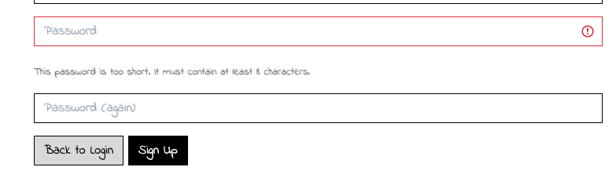

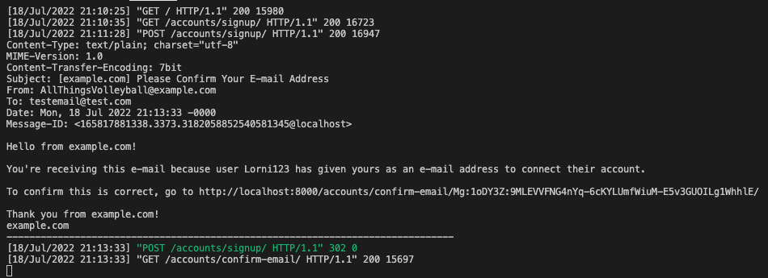
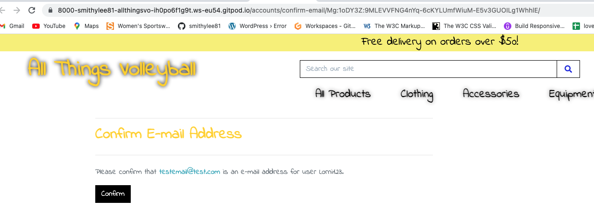
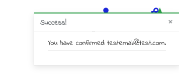
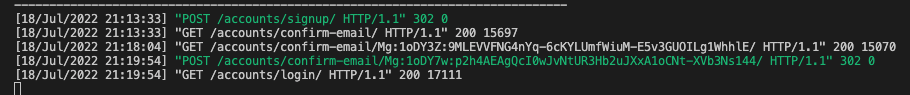

**Outcome: Pass**

- ## Log In

**Acceptance Criteria**: A user should be able to sign in to their account and have the option to view their profile, see their default delivery details and order history.

**Summary:** Sign in form is easy to use, has pre-fixes in the required fields and a "Sign Up" button. The form also has warning messages for any fields left blank to advise the user to fully complete their information, as per the above screenshots. 'Toast' messsges are also displayed ot tell the user they have successfully signed in.

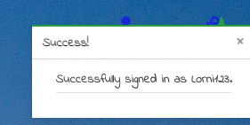

**Outcome: Pass**

- ### Forgot Password

**Acceptance Criteria**: A user should be able to have the facility to reset their password should they forget it and go back to the login page should they remember it. The user should have clear instructions and information on what to do next.

**Summary:** Forgotten password form easy to use, has pre-fixes in the required field and a "Reset my Password" button. The form also has warning messages for any fields left blank to advise the user to fully complete their information, as per the above screenshots. 'Toast' messsges are also displayed ot tell the user they have successfully signed in.

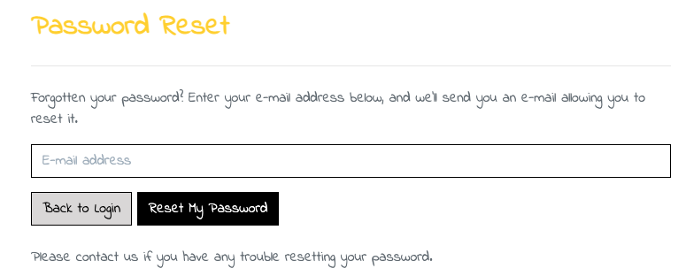
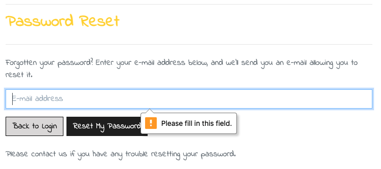
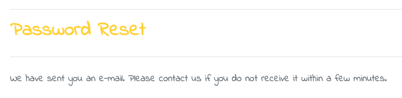
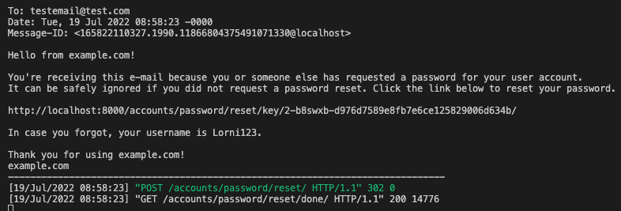
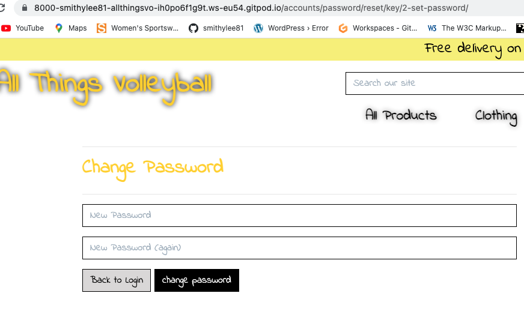
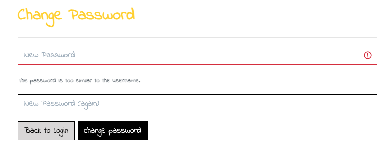
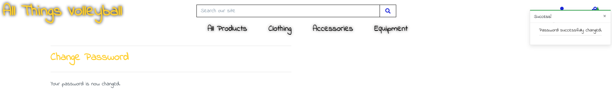

**Outcome: Pass**

  - ### My Profile

**Acceptance Criteria**: A user should be able to access their own profile easily onced logged in and view my 'Default Delivery Information' & my 'Order History'.

**Summary:** Profile selection works well upon log-in and displays both delivery information and order history. 

**Outcome: Pass**

  - #### Update Information

**Acceptance Criteria**: A user should be able to access their own profile easily & update their delivery information. 

**Summary:** Update information button easy to see and saves new information accordingly with a **toast** alert section confirming the "profile updated successfully".

**Outcome: Pass**

### ***Product Management***

**Acceptance Criteria**: A a 'Superuser' I should be able to access the 'Product Management' section and add products and delete or edit where necessary. I should also be able to select an image if desired and have easy to use buttons available to add a product. I should also be able to edit or delete any item/product on each page of the site.

**Summary:** Superuser log in works with visibility of 'Product Management' option under the dropdown in 'My Account'. An easy to use form is presented and the options to select an image, cancel the activity and 'Add Product'. On each page of the site each individual product has the option for me to edit or delete. Screenshots below to demonstrate:

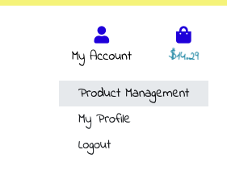

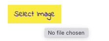

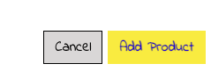

**Outcome: Pass**

### ***Shopping Bag Testing***

**Acceptance Criteria**: A user should be able to add items to their shopping bag, access their shopping bag, have the option to update the quantity of their selections, remove items they no longer require, an option to keep shopping and an option to go to the secure checkout. They should be able to complete their order securely and have clear instructions throughout with an option to adjust their shopping bag even at the point of the secure checkout.

**Summary:** All options for the above criteria are available and work well providing the user with ease of use for their shopping experience.

- #### Shopping Bag Empty Keep Shopping
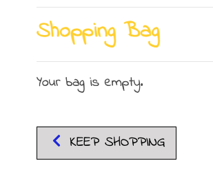
- #### Add to Bag

- #### Update Quantity
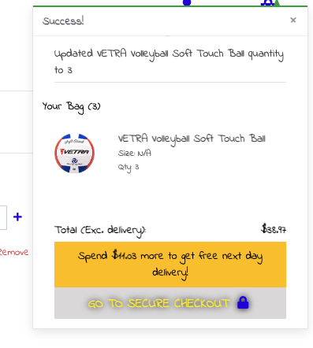
- #### Remove Item
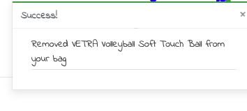
- #### Keep Shopping
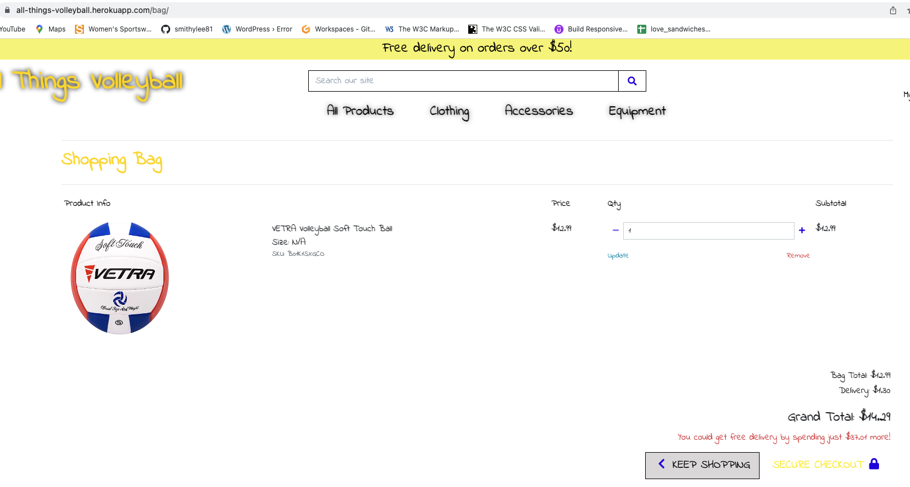
- #### Secure Checkout
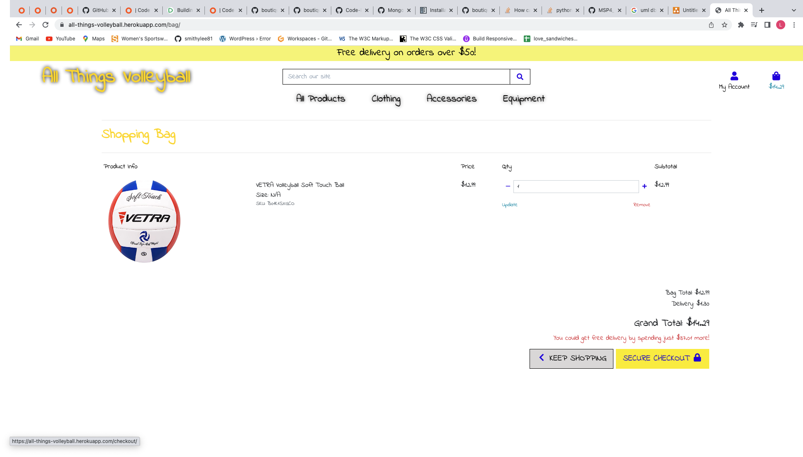

  - ##### Adjust Bag

  - ##### Complete Order
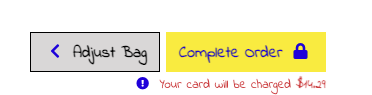

**Outcome: Pass**

[Back to contents](#contents)
### ***Search Bar Testing***

**Acceptance Criteria**: A user should be able to search for items on the site and receive back the correct items.

**Summary:** All search criteria tried and brings back the correct items requested each time.

**Outcome: Pass**
### ***Main Logo Testing***

**Acceptance Criteria**: A user should be able to select the main logo to take them back to the home page no matter what page of the site they are on.

**Summary:** Main logo on all pages works well bringing the user back to the home page.

**Outcome: Pass**

[Back to contents](#contents)

## Product Category Testing

**Acceptance Criteria**: A user should also be able to use the selection bar at the top of the page to browse and select out the items they wish. Each section and dropdown should provide the user with their specific request.

**Summary:** All options selected from the selection bar and dropdown menu's display the correct items requested each time as demonstrated below, along with the filters to display items "Sort by..." such as Price 'low to high', Rating, Name and Category respectively. 
### ***All Products***
 - ##### By Price
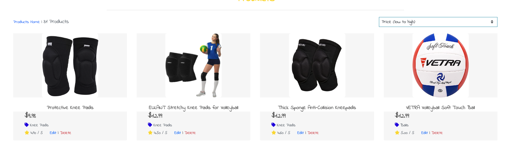
 - ##### By Rating
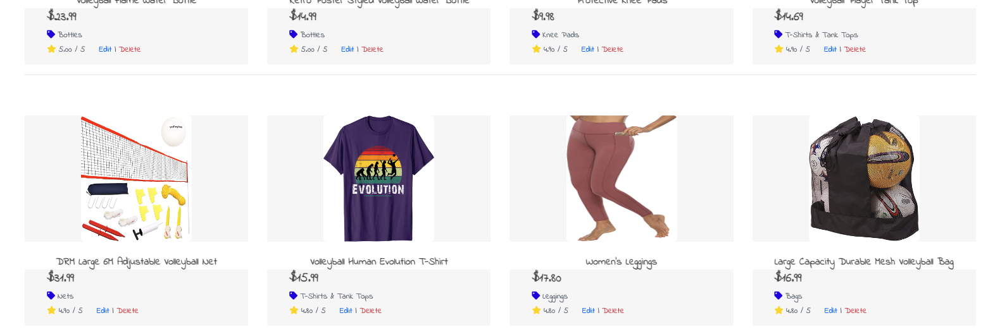
 - ##### By Category
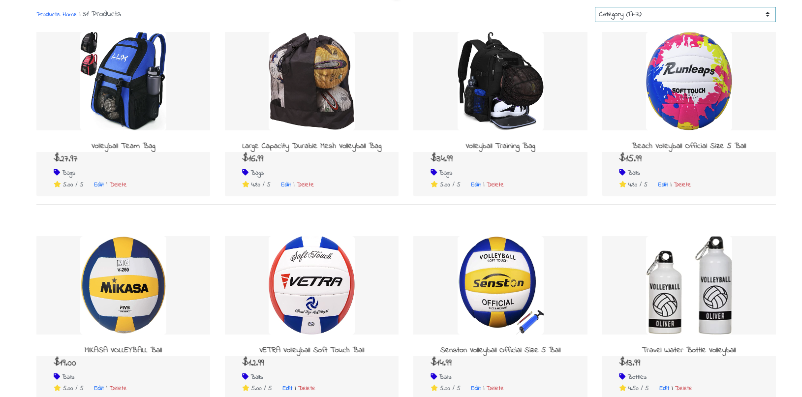
 - ##### All Products
Displays all products successfully.
### ***Clothing***
 - ##### Leggings

 - ##### T-Shirts & Tank Tops

 - ##### Hoodies
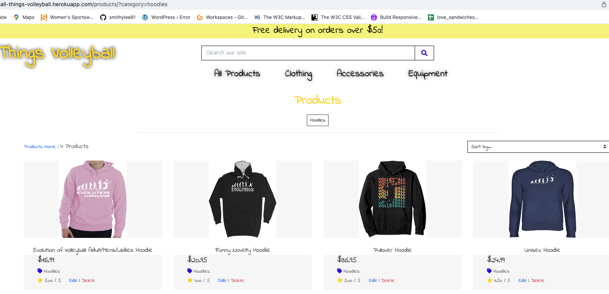
 - ##### All Clothing
Displays all clothing successfully.

[Back to contents](#contents)

### ***Accessories***

 - ##### Bags
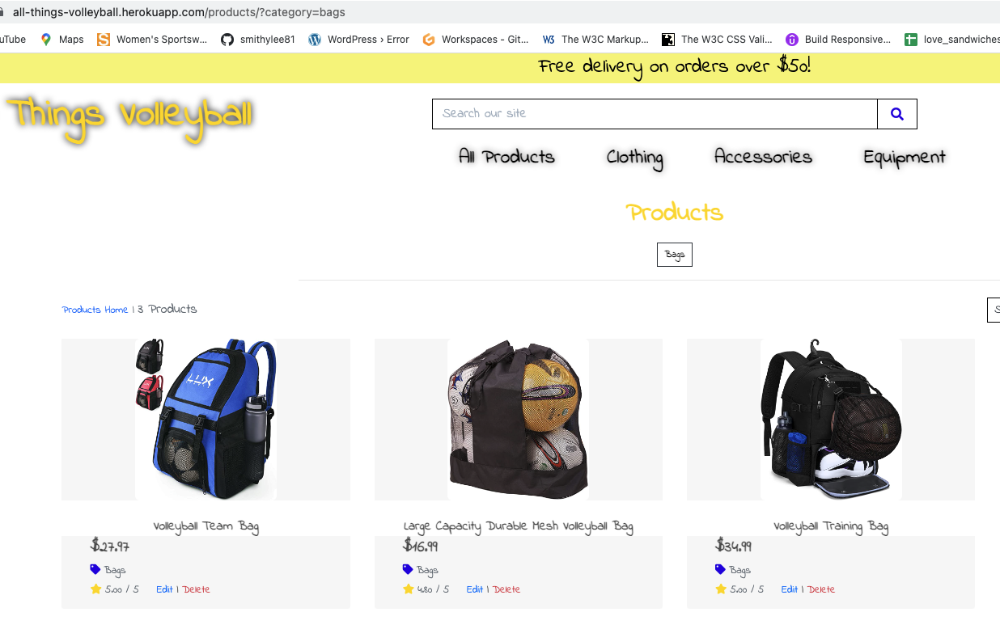
 - ##### Bottles
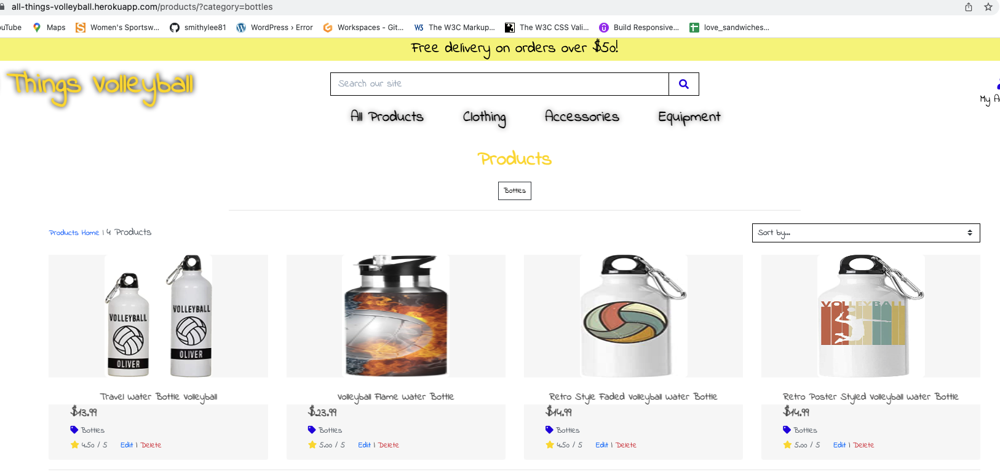
 - ##### Knee Pads
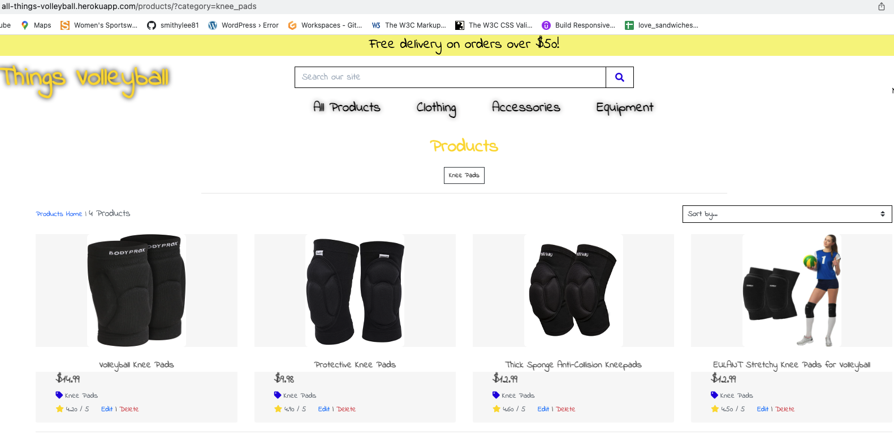
 - ##### All Accessories
Displays all accessories successfully.

[Back to contents](#contents)
### ***Equipment***

 - ##### Balls
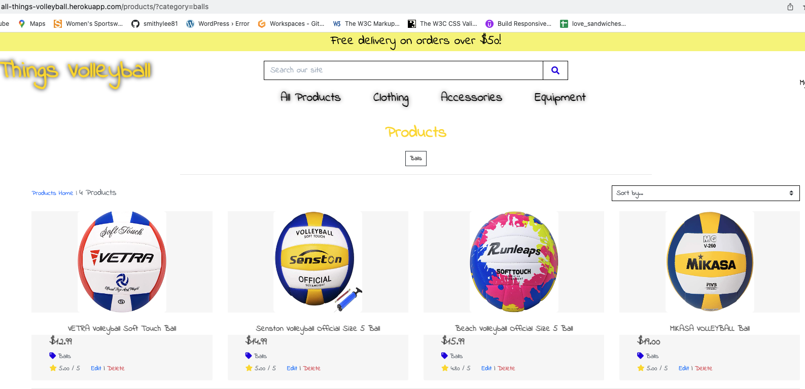

 - ##### Nets
 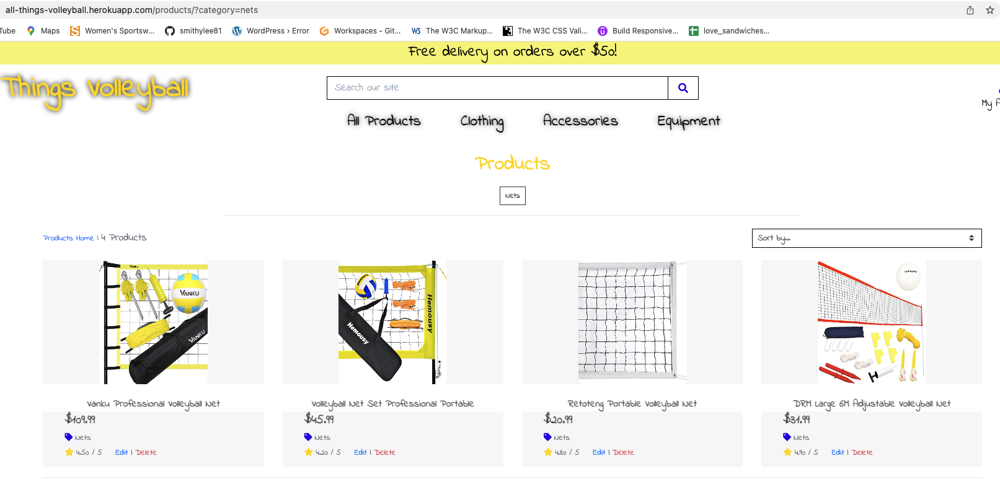
 - ##### All Equipment
Displays all equipment successfully.

 **Outcome: Pass**

 ## Product Page Testing

 **Acceptance Criteria**: A user should be able to view each individual product, have the option to keep shopping and the option to add it to their shopping bag. Where size of clothes is relevent the option to choose size should display. ONcce any product has been added to the bag they should have the option on th epage to go to the secure checkout. 

**Summary:** 

**Outcome: Pass**

- ##### Product Page Keep Shopping
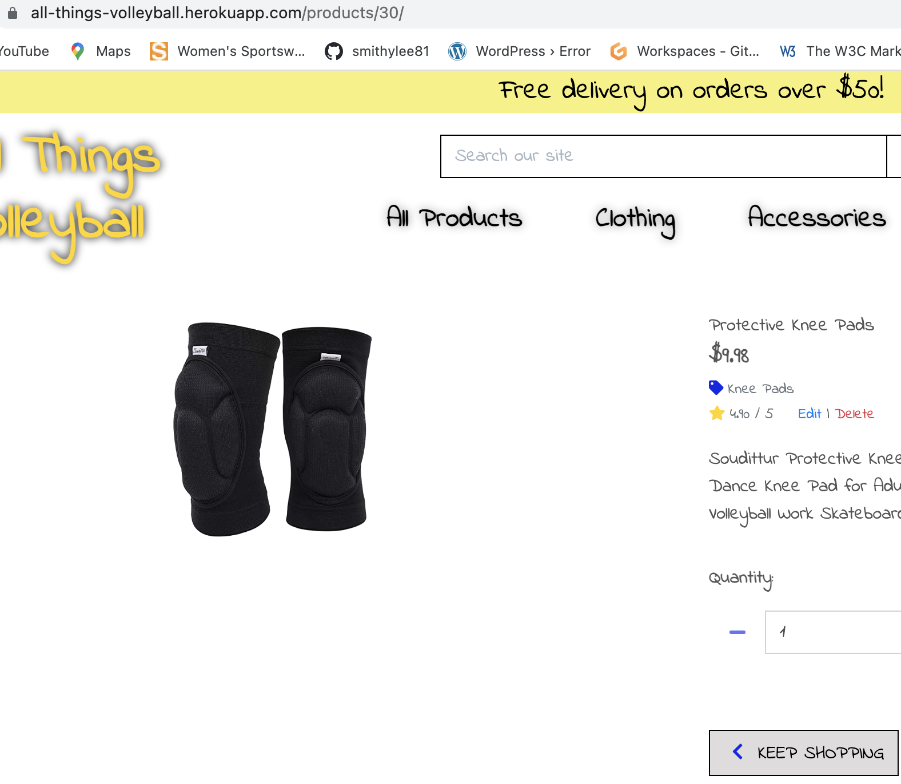
- ##### Product Size Option
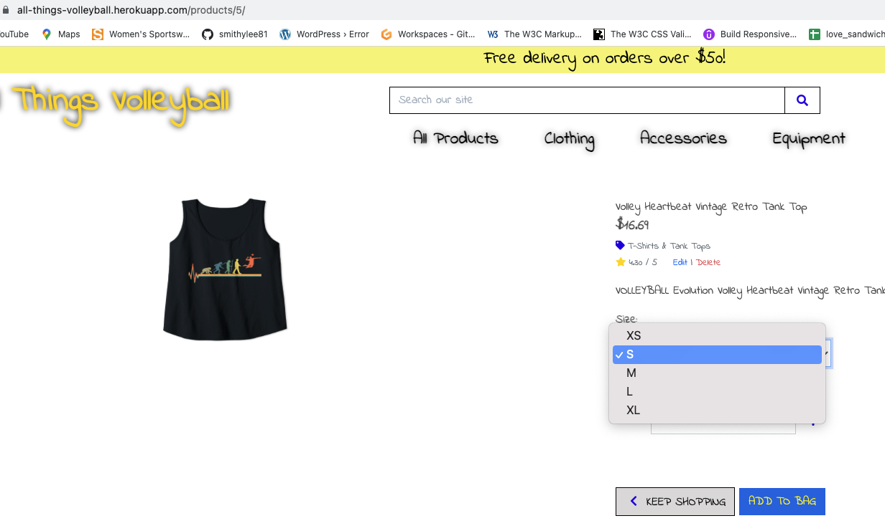
- ##### Product Page Add to Bag
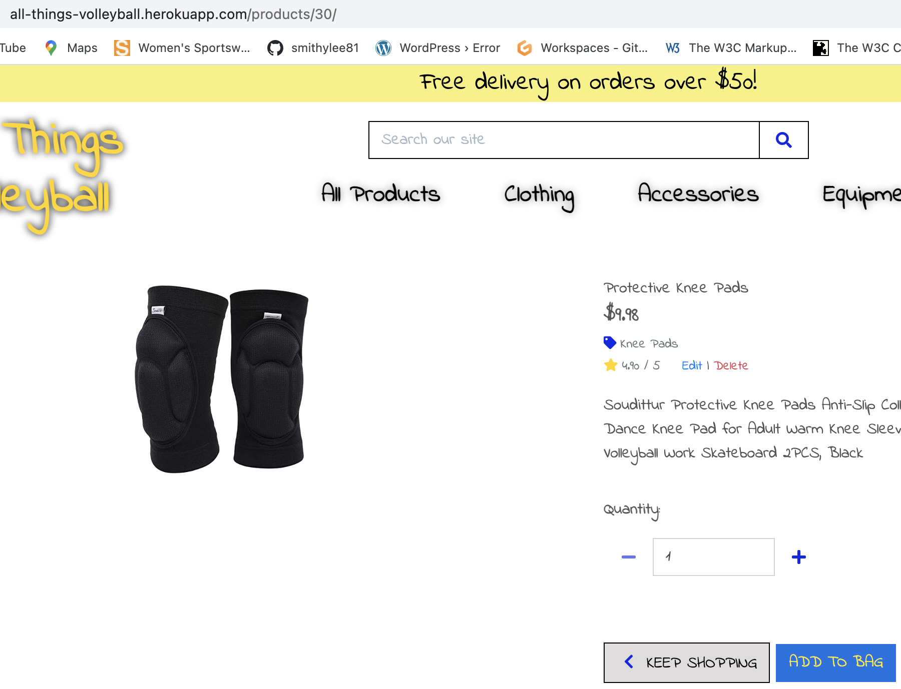
- ##### Product Page Go to secure checkout
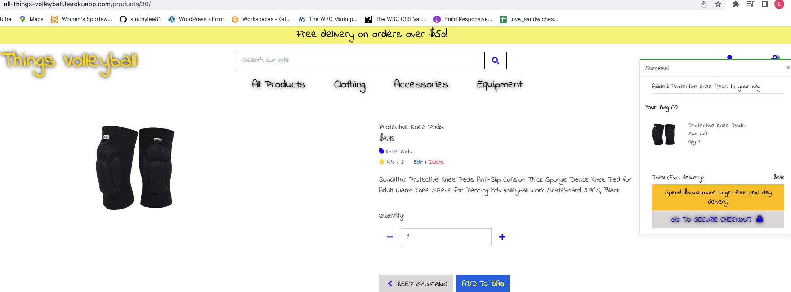

[Back to contents](#contents)

# Validators and Tools
### W3C Markup Validation
<!-- * [W3C Markup Validation](https://validator.w3.org/) was used to validate the HTML codes of the website in all pages. There were only minor errors and warnings such as duplication of class, missing attributes in form fields, missing session heading, etc. They were all fixed accordingly to show no errors afterwards. Labels for form fields were added to make it more accessible. -->

### W3C CSS Validation

<!-- [W3C CSS Validator](https://jigsaw.w3.org/css-validator/) was used to check the CSS syntax. The results show no errors and warnings but the warnings are about prefixes for vendors as I have ran my css codes through a autoprefixer tool. -->

### JSHint
<!-- * [JSHint](https://jshint.com/) was used to check the JavaScript syntax. There were also minor warnings such as missing semicolons and missing variable declaration which were all fixed accordingly. There are still some warnings about unused variables and functions but it is because some of the variables are from Bootstrap (such as `scrollspy`, `bootstrap`), Stripe, or other javascript files.
  
   -->
### PEP8 Online
<!-- * [PEP8 Online](https://pep8online.com/) was used to check the Python syntax.  -->

[Back to contents](#contents)

## Browser Testing

Using Chrome Development tools, either via the pre-set mobile device resolutions or via the manual responsive tool (using `Google Lighthouse Inspection Tool`), the following was completed:

- Manual responsive testing via Chrome Development Tools, selecting `Inspect`.
- Cycling through each available device, and performing the tests as detailed above:
  - iPhone SE
  - iPhone 12 Pro
  - iPhone XR
  - Pixel 5
  - Samsung Galaxy S8+
  - Samsung Galaxy S20 ULtra
  - iPad Air
  - iPad Mini
  - Surface Pro 7
  - Surface Duo
  - Galaxy Fold
  - Samsung Galaxy A51/71
  - Nest Hub
  - Nest Hub Max
- Ensure all Features function,appear correctly from at least 320px wide and are presented appropriately on all viewports:
  - Interaction is enabled.
  - The majorty of the site fits on device's screen.
  - The content is legible.
  - The user can select all available options.
### Mobile and Tablet Testing

The website was physically tested on an iPhone 11, and an iPad. The following tests were completed:

- Ensure all interactive **icons** are distinguishable, identifiable, and are correctly sized and placed to allow users to interact with each of them via touchscreen individually.
- Ensure all inputs within data entry fields and forms respond appropriately to touchscreen devices.
- Ensure all text input fields respond appropriately to on-screen keyboards.
- Ensure the **Dropdown Nav** can be selected to collapse or reveal.

#### ***Chrome/Firefox/Edge/Safari (iOS)***

- All functionality worked as intended.

[Back to contents](#contents)

### Additional Testing

# Significant Bugs

### 1. 

- 

- 

***Fixed: Yes/No***

### 2. 

- 

- 

***Fixed: Yes/No***

## 

- 

- 

- 
-  
- 

***Fixed: Yes/No***

## 

- 

***Fixed: Yes/No***

[Back to contents](#contents)

### Further possible improvements
* Further refactoring could have been done to improve clean code and readability. This was done only to small extend due to the time constraint.
* A more custom designed page for the Django admin dashboard could have been implemented in order to give shop owners/Superusers a much better user experience in controlling and maintaining the database.

---
[Back to contents](#contents)

[Click here](README.md) to return to the main README.md.