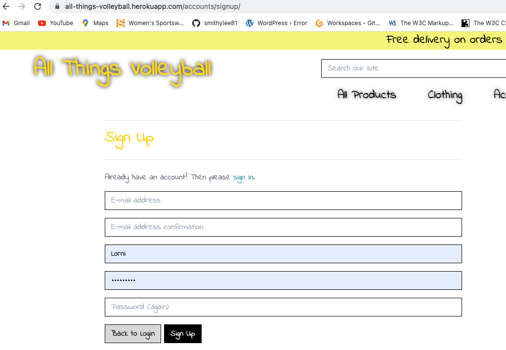
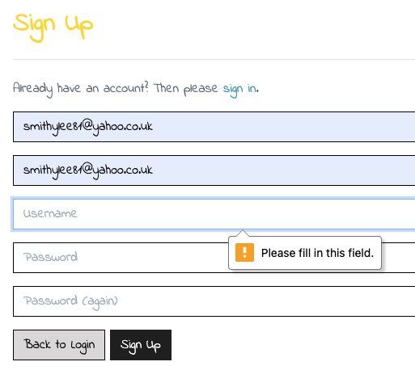
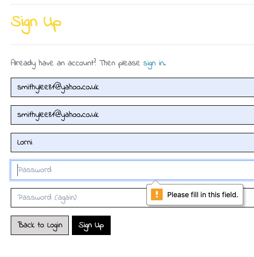
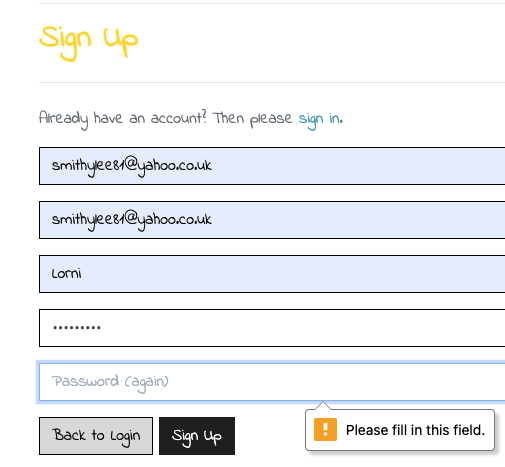
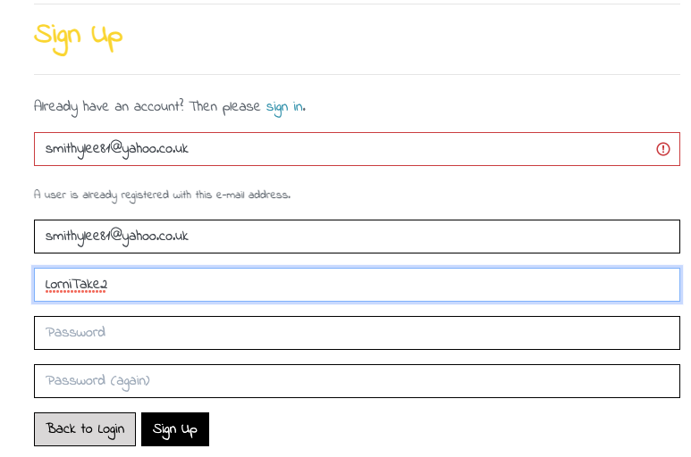
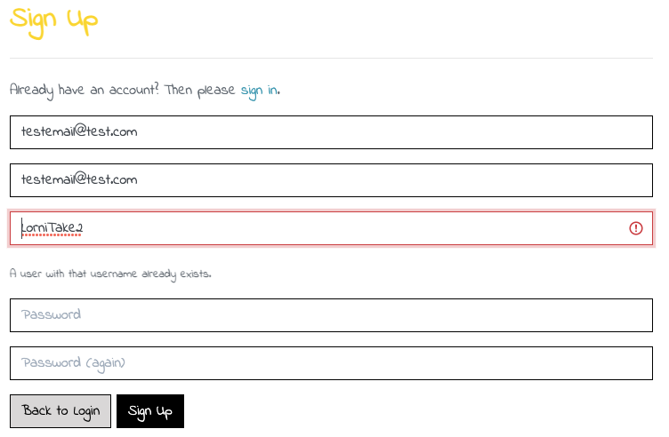
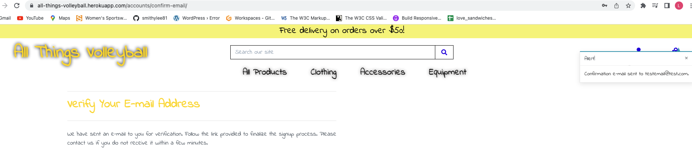
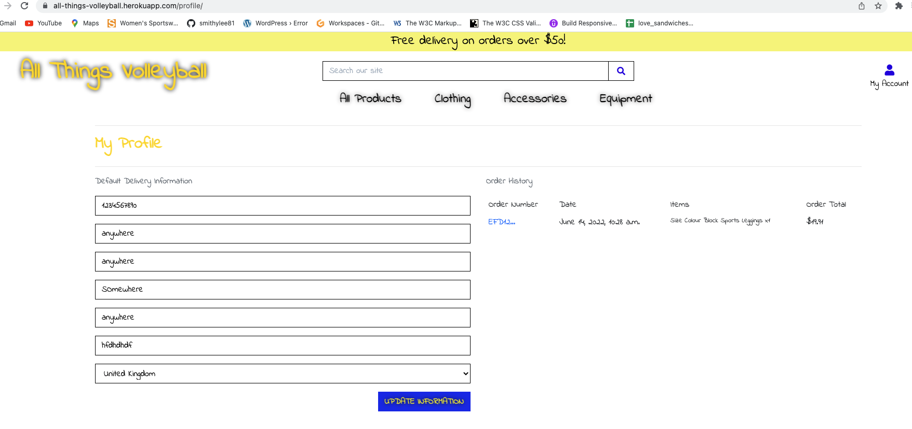
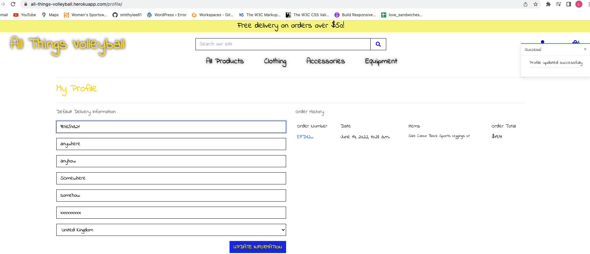

# All Things Volleyball - Testing Documentation

The Main README documentation can be found under [README.md](README.md)

## **Contents**

- [**User Story Testing**](#user-story-testing)
- [**Home Page Testing**](#home-page-testing)
  - [**My Account Testing**](#my-account-testing)
    - [Register](#register)
    - [Log In](#log-in)
     >1. [Forgot Password](#forgot-password)
     >2. [My Profile](#my-profile)
    - [Product Management](#product-management)
  - [**Shopping Bag Testing**](#shopping-bag-testing)
    - [Shopping Bag Empty Keep Shopping](#shopping-bag-empty-keep-shopping)
    - [Update Quantity](#update-quantity)
    - [Remove Item](#remove-item)
    - [Keep Shopping](#keep-shopping)
    - [Secure Checkout](#secure-checkout)
    >1. [Adjust Bag](#adjust-bag)
    >2. [Complete Order](#complete-order)
  - [**Search Bar Testing**](#search-bar-testing)
  - [**Main Logo Testing**](#main-logo-testing)
- [**Product Category Testing**](#product-category-testing)
    - [***All Products***](#all-products)
    >1. [By Price](#by-price)
    >2. [By Rating](#by-rating)
    >3. [By Category](#by-category)
    >4. [All Products](#all-products)
    - [***Clothing***](#clothing)
    >1. [Leggings](#leggings)
    >2. [T-Shirts & Tank Tops](#T-Shirts-&-Tank-Tops)
    >3. [Hoodies](#hoodies)
    >4. [All Clothing](#all-clothing)
    - [***Accessories***](#accessories)
    >1. [Bags](#bags)
    >2. [Bottles](#bottles)
    >3. [Knee Pads](#knee-pads)
    >4. [All Accessories](#all-accessories)
    - [***Equipment***](#equipment)
    >1. [Balls](#balls)
    >2. [Nets](#nets)
    >3. [All Equipment](#all-equipment)
- [**Product Page Testing**](#product-page-testing)
    - [Keep Shopping](#keep-shopping)
    - [Add to Bag](#add-to-bag)
    - [Go to secure checkout](#go-to-secure-checkout)
- [**Validators and Tools**](#validators-and-tools)
- [**Significant Bugs**](#significant-bugs)
- [**Browser Testing**](#browser-testing)
- [**Mobile and Tablet Testing**](#mobile-and-tablet-testing)
- [**Additional Testing**](#additional-testing)
- [**Further possible improvements**](#further-possible-improvements)

## **User Story Testing**
## Home Page Testing
### ***My Account Testing***
- #### Register

**Acceptance Criteria**: A user should be able to register for an account, have an option to sign-in form that selection if they remember they "Already have an Account"? and be able to see clearly what sections of the registration form to complete and a clear indication of what information is required ie: **E-mail address**, **Username** and **Password**. The user should also be given hints if any fields are left blank and if their email address or username is already registered oe exists for another user. The user should recieve an email verification process.

**Summary:** Form is easy to use, has pre-fixes in the required fields and a "Sign Up" button. The form also has warning messages for any fields left blank to advise the user to fully complete their information. 

**Outcome: Pass**

- #### Log In
  - #### Forgot Password

  - #### My Profile

**Acceptance Criteria**: A user should be able to access their own profile easily onced logged in and view my 'Default Delivery Information' & my 'Order History'.

**Summary:** Profile selection works well upon log-in and displays both delivery information and order history. 

**Outcome: Pass**

  - #### Update Information

**Acceptance Criteria**: A user should be able to access their own profile easily & update their delivery information. 

**Summary:** Update information button easy to see and saves new information accordingly with a **toast** alert section confirming the "profile updated successfully".

- #### Product Management

[Back to contents](#contents)
### ***Shopping Bag Testing***
- #### Shopping Bag Empty Keep Shopping
- #### Update Quantity
- #### Remove Item
- #### Keep Shopping
- #### Secure Checkout
  - ##### Adjust Bag
  - ##### Complete Order

[Back to contents](#contents)

### ***Search Bar Testing***

### ***Main Logo Testing***

[Back to contents](#contents)

## Product Category Testing
### ***All Products***
 - ##### By Price
 - ##### By Rating
 - ##### By Category
 - ##### All Products

### ***Clothing***
 - ##### Leggings
 - ##### T-Shirts & Tank Tops
 - ##### Hoodies
 - ##### All Clothing

[Back to contents](#contents)

### ***Accessories***
 - ##### Bags
 - ##### Bottles
 - ##### Knee Pads
 - ##### All Accessories

[Back to contents](#contents)
### ***Equipment***
 - ##### Balls
 - ##### Nets
 - ##### All Equipment

[Back to contents](#contents)

[Back to contents](#contents)

[Back to contents](#contents)

[Back to contents](#contents)

# Validators and Tools
### W3C Markup Validation
<!-- * [W3C Markup Validation](https://validator.w3.org/) was used to validate the HTML codes of the website in all pages. There were only minor errors and warnings such as duplication of class, missing attributes in form fields, missing session heading, etc. They were all fixed accordingly to show no errors afterwards. Labels for form fields were added to make it more accessible. -->

### W3C CSS Validation
<!-- [W3C CSS Validator](https://jigsaw.w3.org/css-validator/) was used to check the CSS syntax. The results show no errors and warnings but the warnings are about prefixes for vendors as I have ran my css codes through a autoprefixer tool. -->

### JSHint
<!-- * [JSHint](https://jshint.com/) was used to check the JavaScript syntax. There were also minor warnings such as missing semicolons and missing variable declaration which were all fixed accordingly. There are still some warnings about unused variables and functions but it is because some of the variables are from Bootstrap (such as `scrollspy`, `bootstrap`), Stripe, or other javascript files.
  
   -->
### PEP8 Online
<!-- * [PEP8 Online](https://pep8online.com/) was used to check the Python syntax.  -->

[Back to contents](#contents)

# Significant Bugs

### 1. 

- 

- 

***Fixed: Yes/No***

### 2. 

- 

- 

***Fixed: Yes/No***

## 

- 

- 

- 
-  
- 

***Fixed: Yes/No***

## 

- 

***Fixed: Yes/No***

[Back to contents](#contents)

### Browser Testing

[Back to contents](#contents)
### Mobile and Tablet Testing

### Additional Testing

### Further possible improvements
<!-- * Further refactoring could have been done to improve clean code and readability. This was done only to small extend due to the time constraint.
* A more custom designed page for admin dashboard could have been implemented in order to give shop owners a much better user experience in controlling and maintaining the database. -->

---
[Back to contents](#contents)

[Click here](README.md) to return to the main README.md.